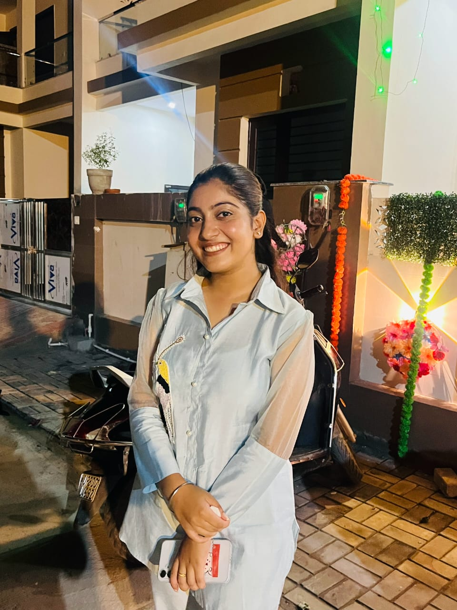

<!DOCTYPE html>
<html lang="en">
<head>
  <meta charset="UTF-8" />
  <meta name="viewport" content="width=device-width, initial-scale=1.0" />
  <title>Shreya Narang Portfolio</title>
  <link rel="stylesheet" href="style.css">
</head>
<body>

  <!-- Hero Section -->
  <section class="hero">
    

      
    

    

      <h1>Shreya Narang</h1>
      
B.Tech Undergraduate

      

        Aspiring software developer focused on solving real-world problems
        through code and continuous learning.
      

      

        <a href="#about"><button>About Me</button></a>
        <a href="#qualifications"><button>Qualification</button></a>
        <a href="#projects"><button>Projects</button></a>
        <a href="#experience"><button>Experience</button></a>
        <a href="#certifications"><button>Certifications</button></a>
        <a href="#contact"><button>Contact</button></a>
      

    

  </section>

  <!-- About Section -->
  <section class="about" id="about">
    

      <h2>Hello there!</h2>
      

        Motivated and detail-oriented B.Tech CSE pre-final year student at
        Hindustan College of Science and Technology, with strong programming
        skills and a passion for full-stack development, AI, and data analytics and more.
      

    

  </section>

  <!-- Qualifications Section -->
  <section id="qualifications" class="qualifications-section">
    

      <h2>Qualifications</h2>
      

        

          <h3>Education</h3>
          
<strong>B.Tech – CSE (2022 to Present)</strong> 
          Hindustan College of Science & Technology, Mathura 
          Pre-Final Year Student

          
<strong>Higher Secondary (2020–2022)</strong> 
          Sumeet Rahul Goel Memorial School, Agra – 81%

          
<strong>Secondary School (Until 2020)</strong> 
          St. Francis Convent School, Agra – 90%

        

        

          <h3>Skills</h3>
          <ul>
            <li>HTML</li><li>CSS</li><li>JavaScript</li>
            <li>React.js</li><li>Node.js</li><li>Python</li>
            <li>SQL</li><li>Canva</li><li>Git</li>
            <li>Excel</li><li>Tableau</li><li>C</li>
          </ul>
        

      

    

  </section>

<!-- Projects Section -->
<section id="projects" class="projects-section">
  <h2>Projects</h2>
  

    

      
      <h3>Hostel Management System</h3>
      <a href=".//project.html" target="_blank">
Know More &gt;&gt;
</a>
    

    

      
      <h3>AI Text Summarizer App</h3>
      <a href=".//project2.html" target="_blank">
Know More &gt;&gt;
</a>
    

    

      
      <h3>SMS Spam Filtering Website</h3>
      <a href=".//project3.html" target="_blank">
Know More &gt;&gt;
</a>
    

  

</section>

  <!-- Experience Section -->
  <section id="experience" class="experience-section">
    <h2>Work Experience</h2>
    

      

        
        <h3>Web Development Intern, Octanet</h3>
        
Dec 2024 – Jan 2025 (Virtual)

      

      

        
        <h3>Data Analytics Simulation – Deloitte Australia (Forage)</h3>
        
May 2025

      

      

        
        <h3>AI for Beginners – HP LIFE</h3>
        
May 2025

      

    

  </section>

  <!-- Certifications Section -->
  <section id="certifications" class="certifications-section">
    <h2>Certifications and Courses</h2>
    

      
C with Data Structures – RCPL, 2024

      
Python Programming – Cambridge International Qualifications, UK, UniAthena, 2024

      
HTML and CSS Bootcamp Certification – LetsUpgrade, 2024

      
AI Text Summarizer Project Certification – Postman, 2024

      
API Fundamentals Student Expert (Basics of API) – Postman, 2024

      
Full Stack Development – RCPL, 2025

      
Udemy Full Stack Web Development Bootcamp – 2025

      
AI for Beginners – HP LIFE, 2025

      
Fundamentals of Artificial Intelligence – HP LIFE, 2025

      
Certificate of Web Development Internship – Octanet, 2025

      
AI in the Classroom – Canva Certification, 2025

      
AI Using Designs – Canva Magic Studio Team, 2025

      
Deloitte Australia Data Analytics Job Simulation on Forage – May 2025

    

  </section>

  <!-- Contact Section -->
  <section id="contact" class="contact-section">
    

      

        
      

      

        <h2>Get in touch</h2>
        
<strong>Email:</strong> shreyanarang30@gmail.com

        
<strong>LinkedIn:</strong> <a href="https://www.linkedin.com/in/shreya-narang-92aa54292" target="_blank">linkedin.com/in/shreya-narang-92aa54292</a>

        
<strong>GitHub:</strong> <a href="https://github.com/ishreyanarang" target="_blank">github.com/ishreyanarang</a>

      

    

  </section>

</body>
</html>
